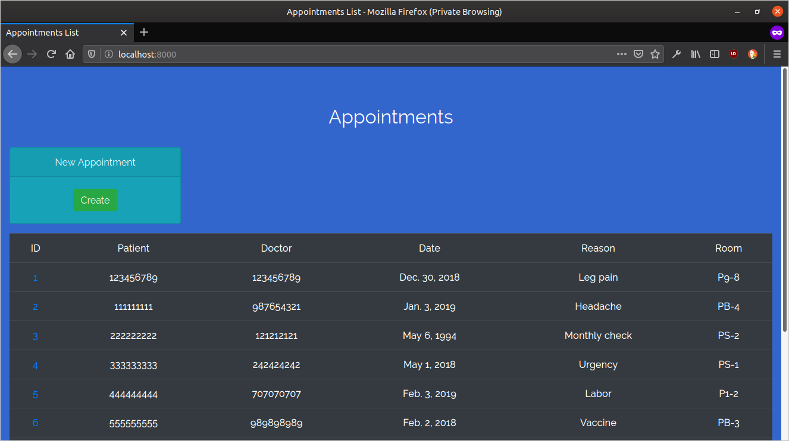
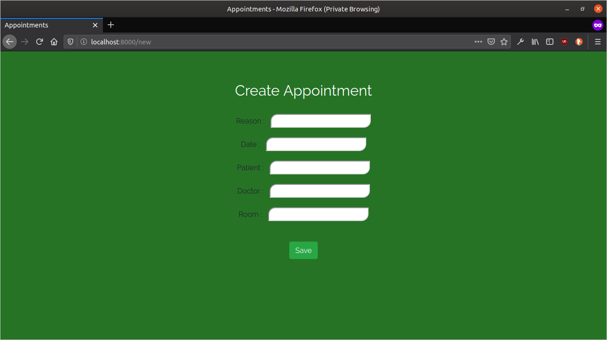
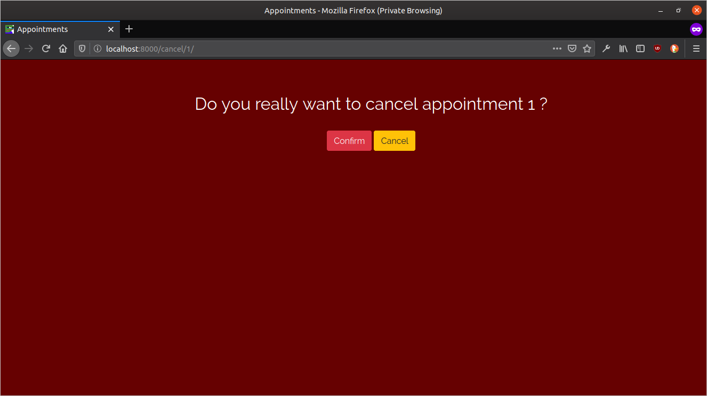

## Setup Environment
It's highly recomended to setup django in a virtual environment

### Setup virtual environment
Create a python virtual environment with `venv` package

```
$ python -m venv <environment name>
```

### Activate the virtual environment
Source the appropriate environment activation script depending on your shell.

```
$ source /path/to/environment/bin/activate
```

Note: `activate` without any suffix is for `Bash` shell.

### Installing Django
Install django in the virtual environment with the following command:

```
$ pip install -r requirements.txt
```
### Setup your own MySQL Server 
```
$ sudo apt install mysql-server python3-dev libmysqlclient-dev default-libmysqlclient-dev
```
### Install MySQL DB Connector
```
$ pip install mysqlclient
```
### Enter MySQL command prompt and Run MySQL Script (Hospital.sql)
```
$ sudo mysql -u root
mysql > source /path/to/script.sql
```
### Create user for admin interface in MySQL
```
mysql > CREATE USER 'newuser'@'localhost' IDENTIFIED BY 'user_password';
```
### Grant Privileges for `newuser` in MySQL
```
mysql > GRANT ALL PRIVILEGES ON <dbname>.* TO `newuser`@`localhost`;
```
## Migrate
Do migration only once before starting the server, or after any change to the database model with

```
python manage.py migrate [port]
```
## Running the server
Run the server with the following code inside the virtual environment:

```
python manage.py runserver [port]
```

## Admin Interface
Create a user in MySQL with the same name (`newuser`) by using `createsuperuser` command in django.
```
python manage.py createsuperuser
```

# Results


